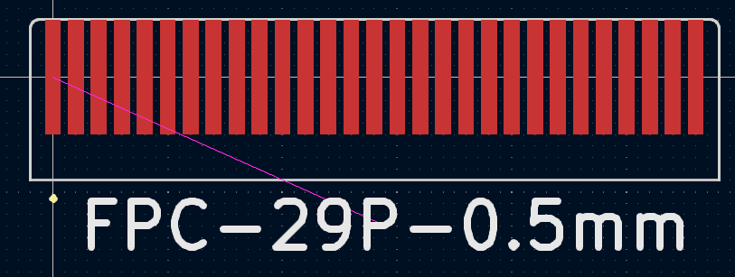

# Kicad_FPC_board_ends
Common board end footprints for FPC connectors and a python script for generating custom versions:

## Common footprints
If you just want to use some common footprints you can download the fpc_board_ends.pretty folder and import it into kicad as normal

These footprints have been generated for:
- 0.5mm pitch, 0.35mm pad width, 2.5mm exposed copper and 3.5mm stiffener, with a 0.2mm radius at the corners 
- 1mm pitch, 0.6mm pad width, 2.5mm exposed copper and 3.5mm stiffener, with a 0.2mm radius at the corners 

## Generating your own footprints
This python package can be installed by pip:
`pip install git+https://github.com/mikeWShef/Kicad_FPC_board_ends`

And run from the command line:
`fpc_footprint_generator 4 0.5 -r 0.2`

Will generate a 4 position 0.5mm pitch board end with a corner radius of 0.2mm

The full arguments are:
`fpc_footprint_generator -h:`

positional arguments:
- positions             The number of positions on the board edge
- pitch                 The pitch of the connector

optional arguments:
-  -h, --help            show this help message and exit
-  --pad_width PAD_WIDTH, -w PAD_WIDTH
-                        The width of the pads in mm, defaults to
-                        pitch/0.5*0.35
-  --pad_length PAD_LENGTH, -l PAD_LENGTH
-                        The length of the pads in mm, defaults to 2.5
-  --stiffener_length STIFFENER_LENGTH, -s STIFFENER_LENGTH
-                        The length of the stiffener in mm, in layer User.1,
-                        defaults to 3.5
-  --radius RADIUS, -r RADIUS
-                        The radius of the fillet/chamfer at the corners in mm
-  --chamfer, -c         If set the corners will be chanfered with a distance
-                        set by the radius argument
-  --filename FILENAME, -f FILENAME
-                        The filename of the output file, if not supplied the
-                        default name 'FPC-{positions}P-{pitch}mm' will be used